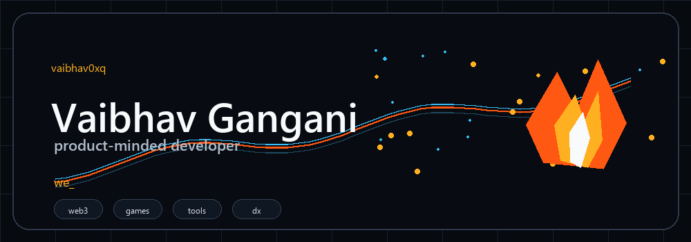
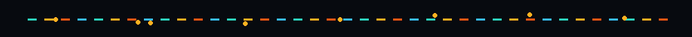
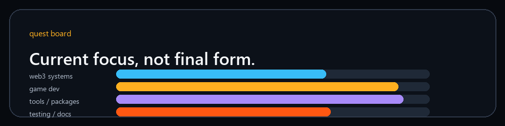
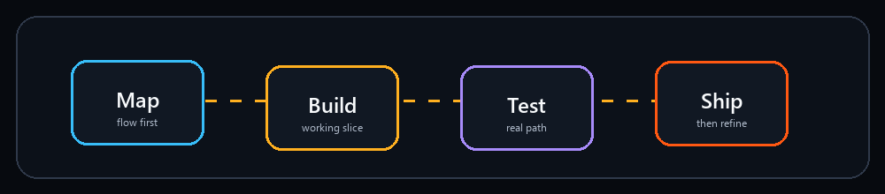

  

  

  <a href="https://github.com/vaibhav0xq">GitHub</a> ·
  <a href="https://x.com/vaibhav_0xq">X</a> ·
  <a href="https://arcidentity.in">Arc Identity</a>

## Now Loading

  

I build across product ideas, protocols, interfaces and developer workflows.

I like projects that start as experiments and become useful: clean flows, readable systems, better docs and small details that make software feel good to use.

## Current Questlines

- Web3 apps, wallets, identity and proof layers
- Games and interactive product experiences
- Developer tools, packages and workflow experiments
- Testing, software quality and documentation
- New chains, protocols and app ideas

## Selected Builds

  
  

  

  More builds are coming. This profile is meant to grow with the work, not lock into one niche.

## Inventory

  

  
  
  
  
  

  

## Activity

  
  

  

  
<b>Side quests I want to explore</b>

 

- Wallet identity and reputation systems
- Public proof and receipt layers
- Sui and Move experiments
- Game development fundamentals
- Package publishing
- Testing tools and better developer workflows
- Hackathon builds and fast product prototypes

  

  

