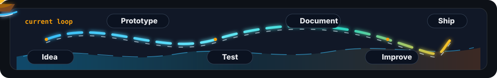
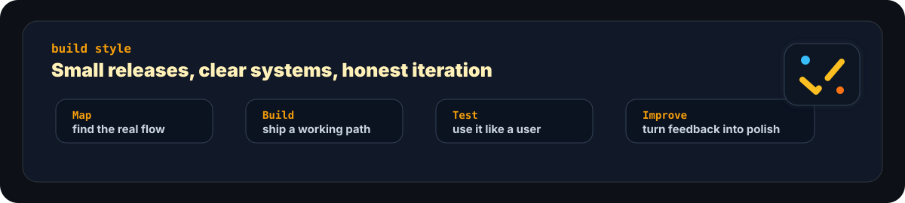

  

<h2 align="center">
  
</h2>

  
  
  

  

## About

I build product-focused software across Web3, interactive experiences and developer tools.

My work usually starts with a rough product idea, then moves into a small working version with clear flows, readable systems and enough documentation for another developer to understand the path.

  

## Focus

- Web3 apps, wallets, identity and proof layers
- Games and interactive product experiences
- Developer tools, packages and workflow experiments
- Hackathon builds and shipped prototypes
- Testing, software quality and better developer workflows

## Stack

  

  
  
  
  
  
  

## Work

| Project | What it explores |
|---|---|
| [Arc Identity](https://github.com/vaibhav0xq/arc-identity-public) | Wallet identity and reputation layer for the Arc ecosystem |
| [Vyom](https://github.com/vaibhav0xq/vyom) | Time-locked digital capsules with Sui wallet reveal flows |
| [Receipts Network](https://github.com/vaibhav0xq/receipts-network) | Public proof pages for preserving links, files and context |

  
  

  

  

## GitHub Motion

  

  
  

  

  

## Build Style

  

  
Exploring next

- More polished public software projects
- Better docs, demos and issue roadmaps
- Game development and interactive systems
- Package publishing and reusable developer tools
- More chains, protocols and wallet workflows

  

